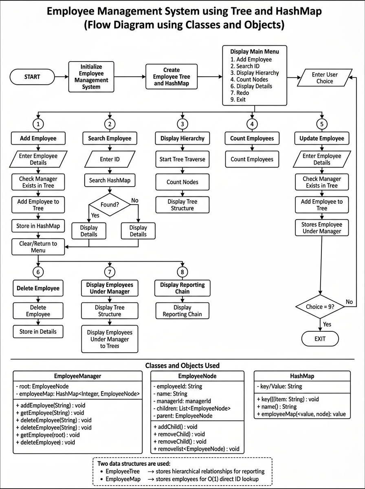

# Employee Management System using Tree and HashMap

A simple console-based Java Employee Management System that demonstrates
company hierarchy management using Tree Data Structure and efficient employee
searching using HashMap. The project is designed as a Low-Level Design (LLD)
implementation showcasing Object-Oriented Programming (OOP) concepts such as
classes, objects, encapsulation, abstraction, and object composition.

## Overview

The application allows users to:

- Add Employee
- Search Employee
- Display Company Hierarchy
- Count Employees
- Update Employee
- Delete Employee
- Display Employees Under Manager
- Display Reporting Chain
- Exit the application

The system uses two important data structures:

- **Tree** – Represents the company's reporting hierarchy.
- **HashMap** – Provides fast searching of employees using Employee ID.

---

## Problem Statement

Develop a console-based Employee Management System that models a company's
reporting structure as a tree and supports employee operations efficiently
using Tree and HashMap while following Object-Oriented Programming principles.

---

## Objectives

- Implement an employee management system in Java.
- Represent organizational hierarchy using Tree Data Structure.
- Implement employee searching using HashMap.
- Perform CRUD operations on employee records.
- Apply OOP concepts using classes and objects.
- Build a menu-driven console application.

---

## Features

- Add new employees
- Search employee by ID
- Display complete company hierarchy
- Count total employees
- Update employee details
- Delete employees
- Display employees under a manager
- Display reporting chain
- Menu-driven interface
- Tree-based hierarchy management
- HashMap-based employee searching

---

## Technologies Used

- Language: Java
- IDE: Visual Studio Code
- Data Structures: Tree and HashMap
- Version Control: Git
- Repository: GitHub

---

# Data Structures Used

## Tree

The company hierarchy is represented using a Tree Data Structure.

Each employee acts as a node in the tree.

Example:

```
Amal (CEO)
   |
   Ashmika (Project Manager)
        |
        Ajal (Software Developer)
             |
             Swapna (Software Developer)
                  |
                  Sethu (Software Developer)
```

The Tree is used for:

- Maintaining manager-subordinate relationships.
- Displaying company hierarchy.
- Displaying reporting chain.

---

## HashMap

The system maintains employee records using HashMap.

Employee ID is used as the key to quickly access employee details.

Advantages:

- Fast employee searching.
- Average search complexity: O(1).

---

# Project Structure

```
Employee-Management-System
│
├── README.md
├── .gitignore
│
├── docs
│   ├── ProjectDocumentation.md
│   └── FlowDiagram.png
│
├── output
│   └── SampleOutput.txt
│
└── src
    ├── Main.java
    ├── Employee.java
    └── EmployeeManagementSystem.java
```

---

# Flow Diagram

Flow Diagram



---

# Classes Used

The project contains three main classes:

## Main

Responsibilities:

- Displays the menu.
- Reads user input.
- Creates EmployeeManagementSystem object.
- Controls program execution.

---

## Employee

Represents an employee node.

Attributes:

- Employee ID
- Employee Name
- Designation
- Manager
- Subordinates

---

## EmployeeManagementSystem

Responsible for employee operations.

Methods:

- addEmployee()
- searchEmployee()
- displayHierarchy()
- countEmployees()
- updateEmployee()
- deleteEmployee()
- displaySubordinates()
- displayReportingChain()

---

# Algorithm

1. Start the application.

2. Create EmployeeManagementSystem object.

3. Initialize:
   - Employee Tree
   - Employee HashMap

4. Display the menu.

5. Read user's choice.

### Add Employee

- Get employee details.
- Find manager.
- Add employee to Tree.
- Store employee details in HashMap.

### Search Employee

- Enter Employee ID.
- Search employee using HashMap.
- Display employee details.

### Display Company Hierarchy

- Traverse Tree.
- Display complete organization structure.

### Count Employees

- Traverse Tree nodes.
- Display total employee count.

### Update Employee

- Search employee.
- Modify employee information.

### Delete Employee

- Remove employee from Tree and HashMap.

### Display Employees Under Manager

- Find manager node.
- Display subordinate employees.

### Display Reporting Chain

- Traverse manager relationship.
- Display reporting path.

6. Continue until Exit option is selected.

---

# Sample Output

```
======================================
 EMPLOYEE MANAGEMENT SYSTEM
======================================

1. Add Employee
2. Search Employee
3. Display Company Hierarchy
4. Count Employees
5. Update Employee
6. Delete Employee
7. Display Employees Under Manager
8. Display Reporting Chain
9. Exit


Company Hierarchy
-----------------------
Amal (CEO)
   Ashmika (Project Manager)
      Ajal (Software Developer)
         Swapna (Software Developer)
            Sethu (Software Developer)
```

---

# OOP Concepts Used

- Classes and Objects
- Encapsulation
- Abstraction
- Object Composition
- Modularity

---

# Future Enhancements

- GUI using Java Swing or JavaFX
- Database integration
- Employee login system
- Role-based access control
- Web-based employee management system

---

# Learning Outcomes

- Understanding of Tree Data Structure.
- Practical implementation of HashMap.
- Experience with Java Object-Oriented Programming.
- Understanding Low-Level Design principles.
- Git and GitHub version control.

---

# Author

Amal Krishna S

Electrical and Electronics Engineering

---

# License

This project is developed for educational and academic purposes.